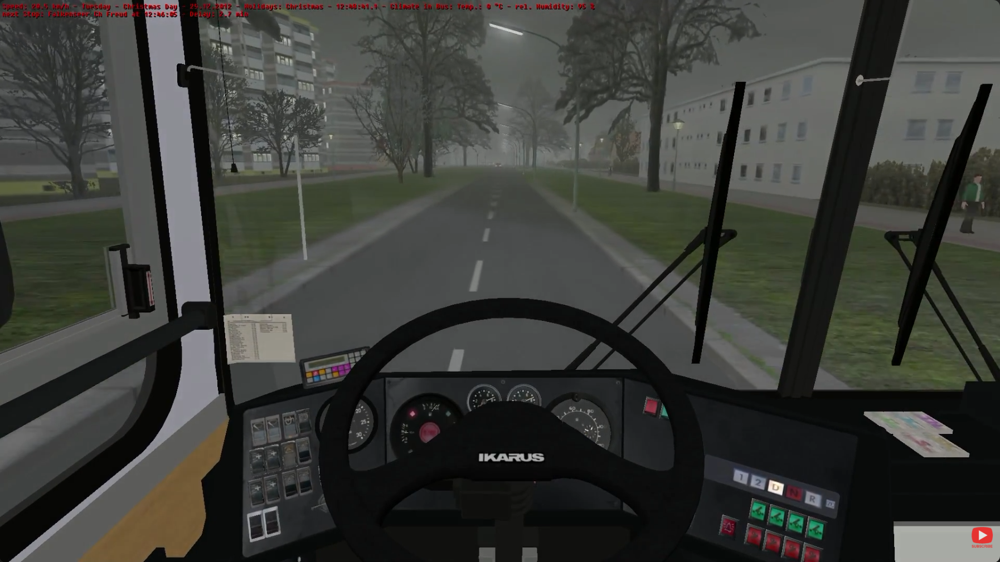
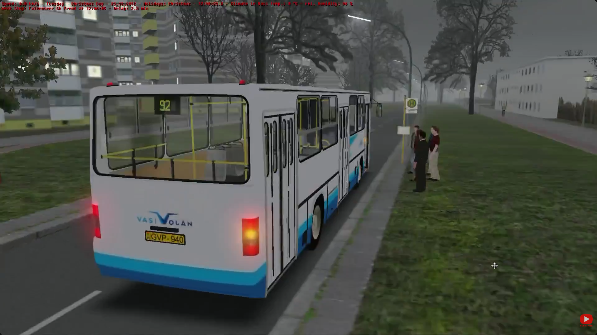
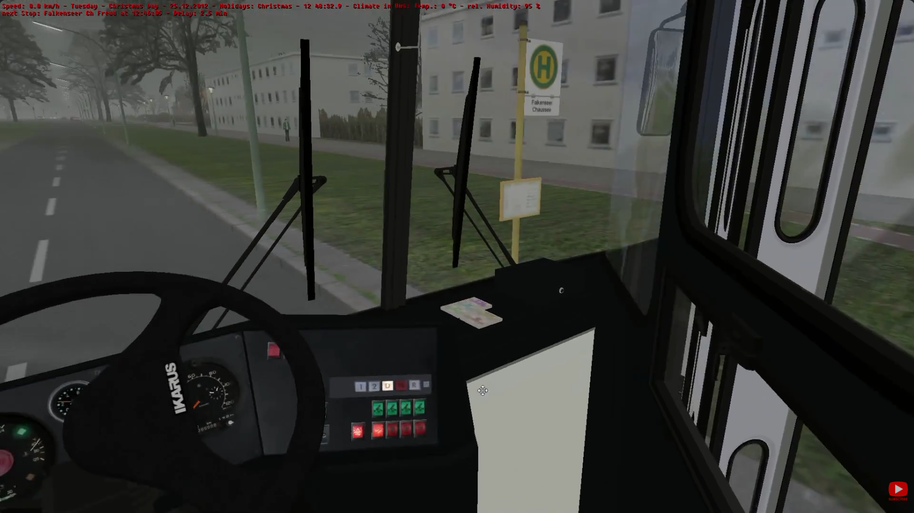
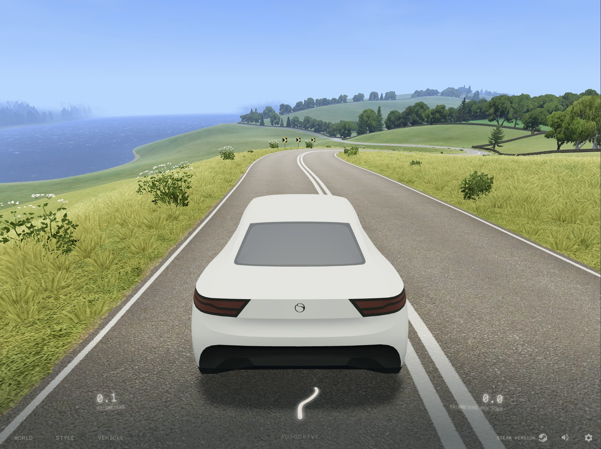

# Especificação da Implementação

> [!CAUTION]
> - Você <ins>**não pode utilizar ferramentas de IA para escrever esta
>   especificação**</ins>

> [!WARNING]
> - Após a entrega da primeira versão completa, esta especificação não
>   poderá ser alterada. A implementação final deverá corresponder ao que
>   estiver descrito neste arquivo.

## Integrantes da dupla

- **Aluno 1 - Nome**: Eric Peracchi Pisoni
- **Aluno 1 - Cartão UFRGS**: 00318500

- **Aluno 2 - Nome**: Pedro Henrique Freitas Fleck
- **Aluno 2 - Cartão UFRGS**: 00233700

## Detalhes do que será implementado

- **Título do trabalho**: Branquinho: Rota do Vale
- **Parágrafo curto descrevendo o que será implementado**: Um simulador do ônibus circular do Campus do Vale

## Especificação visual

### Vídeo - Link

> [!IMPORTANT]
> - Coloque aqui um link para um vídeo que mostre a aplicação gráfica
>   de referência que você vai implementar. **Sua implementação deverá
>   ser o mais parecido possível com o que é mostrado no vídeo (mais
>   detalhes abaixo).**
> - **Você não pode escolher como referência: (1) algum trabalho realizado
>   por outros alunos desta disciplina, em semestres anteriores. (2) Minecraft.**
> - Por exemplo, você pode colocar um vídeo de um jogo que você gosta,
>   e seu trabalho final será uma re-implementação do jogo.
> - O vídeo pode ser um link para YouTube, Google Drive, ou arquivo mp4 dentro
>   do próprio repositório. Mas, garanta que qualquer um tenha
>   permissão de acesso ao vídeo através deste link.

https://youtu.be/TE3m94hVeD8

### Vídeo - Timestamp

> [!IMPORTANT]
> - Coloque aqui um **intervalo de ~30 segundos** do vídeo acima, que
>   será a base de comparação para avaliar se o seu trabalho final
>   conseguiu ou não reproduzir a referência.

- **Timestamp inicial**: 03:30
- **Timestamp final**: 04:00

### Imagens

> [!IMPORTANT]
> - Coloque aqui **três imagens** capturadas do vídeo acima, que você
>   irá usar como ilustração para as explicações que vêm abaixo.
> - As imagens devem estar armazenadas neste repositório, no diretório
>   `images/spec/`, com os nomes `image1`, `image2` e `image3`.
> - Cada imagem deve usar o formato `.jpg` ou `.png`. Ajuste a extensão
>   nos vínculos abaixo para que corresponda ao arquivo armazenado.
> - Escolha imagens que correspondam a momentos do intervalo indicado
>   acima ou que sejam relevantes para a comparação com a implementação.

#### Imagem 1

- **Descrição**: Inspiração de como deve ser a câmera Dashboard em primeira pessoa, com o painel do veículo visível.

#### Imagem 2

- **Descrição**: Câmera Orbit que pode ser controlada lateralmente pelo usuário, mostrando o exterior do ônibus com os passageiros aguardando no ponto para embarcar.

#### Imagem 3

- **Descrição**: Destaque a algumas limitações que serão explicadas ao final do documento, como os espelhos e os botões no painel.

> Comentário Professor: Implementem os seguintes efeitos presentes na referência visual: névoa volumétrica, iluminação dos postes, vidros transparentes e espelhos retrovisores.

#### Extra (gráficos):

- **Descrição**: Outra referência de gráficos que buscamos alcançar é o jogo Slowroads, que pode ser jogado diretamente do navegador através do link https://slowroads.io/

## Especificação textual

Para cada um dos requisitos abaixo (detalhados no [Enunciado do Trabalho final - Moodle](https://moodle.ufrgs.br/mod/assign/view.php?id=6302370)), escreva um parágrafo **curto** explicando como este requisito será atendido, apontando itens específicos do vídeo/imagens que você incluiu acima que atendem estes requisitos.

### Malhas poligonais complexas
Serão implementados diversos modelos 3D com malhas poligonais complexas.
- O veículo que será conduzido pelo jogador, que é uma representação do ônibus Mascarello Gran Midi 2005 usado na linha circular do Campus do Vale.
- O cenário do jogo terá elementos que remetem ao Campus do Vale, como prédios, pórtico de entrada e outras estruturas.

### Transformações geométricas controladas pelo usuário
O veículo virtual será conduzido pelo usuário através de transformações de translação e rotação, que serão aplicadas com base em um modelo simples que simula o comportamento de um automóvel.

### Diferentes tipos de câmeras
O jogo terá dois tipos de câmera:
1. Dashboard cam - visão em primeira pessoa, no assento do motorista olhando para frente, com visão do painel do veículo.
2. Orbit cam - visão em terceira pessoa elevada que pode ser controlada para olhar para os lados.

### Instâncias de objetos
Alguns objetos, como árvores e postes, serão copiados em múltiplas instâncias para montar o cenário do jogo.

### Testes de intersecção
Para evitar que o veículo atravesse paredes ou objetos, será implementado testes de colisão entre o veículo e o cenário.
Também haverá *checkpoints* que o jogador deve atingir.

### Modelos de Iluminação em todos os objetos
Será implementado *Phong shading* nos objetos do jogo.

### Mapeamento de texturas em todos os objetos
As texturas aplicadas aos objetos serão adquiridas a partir de fotografias em alta resolução de diferentes pontos do Campus do Vale.

### Movimentação com curva Bézier cúbica
Os pedestres que caminham na calçada terão sua movimentação definida por curvas de Bézier.

### Animações baseadas no tempo ($\Delta t$)
As animações dos pedestres caminhando serão baseadas no tempo.

> Comentário Professor: Implementem a física do veículo ao se deslocar por terrenos com relevo conforme as referências visuais. Baseiem essa movimentação no tempo também.

### Funcionalidade extra obrigatória

> [!IMPORTANT]
> - Descreva a funcionalidade extra relacionada à Computação Gráfica
>   que será implementada.
> - Esta funcionalidade também deverá ser documentada no arquivo
>   `README.md` da entrega final.

**Sistema de partículas/fumaça:**
Os pneus do veículo produzem efeitos de fumaça quando submetido a acelerações bruscas, como arrancadas, frenagens e curvas em alta velocidade.

## Limitações esperadas

> [!IMPORTANT]
> - Coloque aqui uma lista de detalhes visuais ou de interação que
>   aparecem no vídeo e/ou imagens acima, mas que você **não pretende
>   implementar** ou que você **irá implementar parcialmente**.
> - Para cada item, **explique por que** não será implementado ou por
>   que será implementado parcialmente.

- Dashboard cam: possivelmente encontraremos problemas na implementação de uma câmera interna que mostra o painel do veículo.
Caso isso aconteça, utilizaremos uma Bumper cam, que é uma câmera localizada no exterior do ônibus, diretamente à frente do para-choque.
- Buscamos utilizar fotografias reais para atingir um visual um pouco mais fotorrealista, mas caso os resultados não atinjam nossas expectativas, vamos optar por um visual mais minimalista, com texturas mais simples.
- Animações dos pedestres: reconhecemos que fazer animações realistas de pessoas caminhando seria um desafio consideravelmente difícil, então optamos por animações mais simples para os pedestres.
